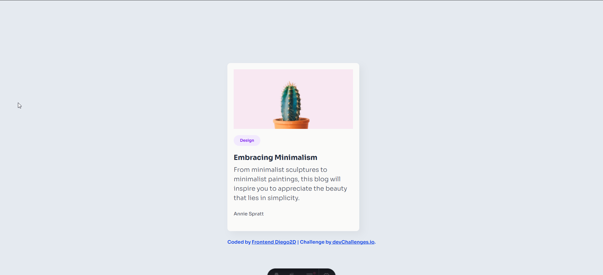

<!-- Please update value in the {}  -->

<h1 align="center"> Minimal Blog Card | devChallenges</h1>

   Solution for a challenge <a href="https://devchallenges.io/challenge/minimal-blog-card" target="_blank">Minimal Blog Card</a> from <a href="http://devchallenges.io" target="_blank">devChallenges.io</a>.

  <h3>
    <a href="https://minimal-blog-card-starter-jcv0ows6z-frontenddiego2d16s-projects.vercel.app/">
      Demo
    </a>
     | 
    <a href="https://github.com/frontenddiego2d16/minimal-blog-card-starter">
      Solution
    </a>
     | 
    <a href="https://devchallenges.io/challenge/minimal-blog-card">
      Challenge
    </a>
  </h3>

<!-- TABLE OF CONTENTS -->

## Table of Contents

- [Table of Contents](#table-of-contents)
- [Overview](#overview)
  - [What I learned](#what-i-learned)
  - [Built with](#built-with)
- [Features](#features)
- [Author](#author)

<!-- OVERVIEW -->

## Overview

### What I learned
 - Durante el desarrollo de este proyecto aprendí a crear una aplicación con Astro, configurar Tailwind CSS para el diseño y los estilos, trabajar con variables utilizando su sintaxis y añadir fuentes de Google Fonts para personalizar la interfaz.
 - During the development of this project, I learned how to create an application with Astro, configure Tailwind CSS for styling and design, work with variables using its syntax, and integrate Google Fonts to customize the user interface.

### Built with

- Semantic HTML5 markup
- TailwindCSS custom properties
- Flexbox
- [Astro](https://astro.build/)
- [Tailwind](https://tailwindcss.com/)

## Features

- Una Imagen
- Un Título
- Una Descripción corta
- Una Etiqueta
--------------------
- An image
- A title
- A short description
- A tag

## Author

- Tiktok - [@diego_2d_frontend](https://www.tiktok.com/@diego_2d_frontend) 
- Youtube - [@Diego2Dfrontend](https://www.youtube.com/@Diego2Dfrontend) 
- Instagram - [@frontenddiego2d](https://www.instagram.com/frontenddiego2d/) 
- Facebook - [/FrontendDiego2D](https://www.facebook.com/FrontendDiego2D/) 
